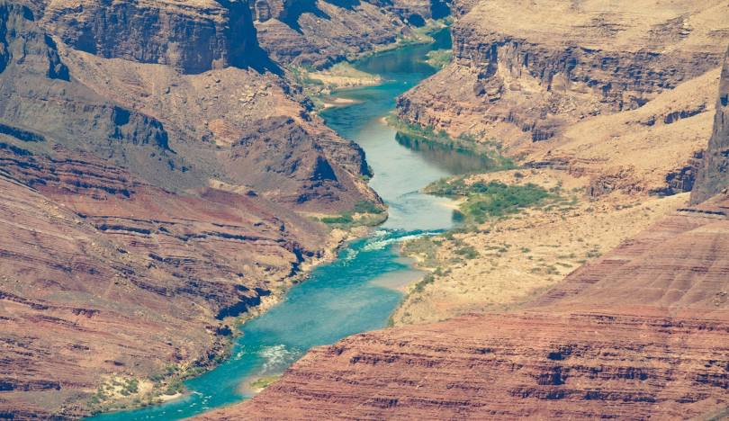

```{r}
#| include: false
knitr::opts_chunk$set(
  fig.width  = 8,
  message    = FALSE,
  warning    = FALSE,
  comment    = "",
  cache      = FALSE,
  fig.retina = 3
)
```

```{r}
#| echo: false
#| fig-align: center
#| out-width: "100%"

```

In January 2023, the federal government announced the first-ever Tier 3 shortage on the Colorado River — triggering mandatory cuts to Arizona, Nevada, and Mexico. Those cuts were calculated from streamflow records like the ones you are about to pull.

The Colorado River Basin supplies drinking water to 40 million people across 7 US states, irrigates 5 million acres of farmland, and is governed by one of the oldest and most contested water rights agreements in American history — the Colorado River Compact of 1922. Understanding how streamflow varies across this system is not an academic exercise. It is the daily work of water managers, federal agencies, tribal water rights holders, and scientists navigating a river under compounding stress from drought, overallocation, and climate change.

In this lab you will work with real streamflow records pulled directly from the **USGS National Water Information System (NWIS)** — the same federal system water managers query every morning. You will build a complete analytical pipeline: from raw API call to normalized comparisons, threshold detection, basin-wide trend visualization, and a predictive model of the Compact's key accounting point.

## Libraries

Install and load the following packages. If any are missing, run `install.packages("packagename")` first:

```{r}
#| eval: true 
#| include: false 
if (!requireNamespace("pacman", quietly = TRUE)) install.packages("pacman")

pacman::p_load(
  tidyverse,
  dataRetrieval,
  zoo,
  patchwork,
  flextable,
  lubridate,
  broom
)


```

::: callout-note
`pacman::p_load()` installs any missing packages and loads them in one step — convenient for students setting up dependencies.
:::

## Data

We will use the `dataRetrieval` package — developed and maintained by the USGS — to pull 44 years of daily mean discharge from 7 long-record gauges spanning the Colorado River's main stem and major tributaries.

The USGS parameter code for discharge is `00060` (cubic feet per second). The statistic code `00003` is the daily mean value. Under the hood, `dataRetrieval` constructs and queries the same REST API URL we explored in lecture:

```
https://waterservices.usgs.gov/nwis/dv/?sites=09380000&parameterCd=00060&statCd=00003
```

The data can be grabbed below!

```{r}
#| label: data-pull
#| cache: true

gauges <- tribble(
  ~site_no,     ~name,                           ~state,
  "09380000",   "Colorado R at Lees Ferry",      "AZ",
  "09163500",   "Colorado R near CO-UT border",  "CO",
  "09085000",   "Colorado R at Glenwood Springs","CO",
  "09306500",   "White R near Watson",           "UT",
  "09379500",   "San Juan R near Bluff",         "UT",
  "09402500",   "Little Colorado R near Cameron","AZ",
  "09421500",   "Colorado R below Hoover Dam",   "NV"
)


raw <- readNWISdv(
  siteNumbers = gauges$site_no,
  parameterCd = "00060",
  startDate   = "1980-01-01",
  endDate     = "2023-12-31"
) |>
  renameNWISColumns() |>              # renames X_00060_00003 → Flow
  left_join(gauges, by = "site_no") |>
  select(site_no, name, state, Date, Flow)

glimpse(raw)
```

Note: this chunk is cached (`cache = TRUE`). If you change the data-pull arguments and need fresh data, set `cache = FALSE` temporarily or delete the `_cache/` directory and re-render to force a new download.

::: callout-tip
## What does `glimpse()` tell you?
Before doing anything with a new dataset, always check: Does the row count make sense? Are data types correct (`Date` should be `<date>`, `Flow` should be `<dbl>`)? Are there obvious NAs or impossible values? For ~7 gauges × 44 years × 365 days you should expect roughly 112,000 rows.
:::

---

# **Question 1**: Daily Conditions Report {#q1}

You are a water resources analyst. Each morning you deliver a reproducible snapshot of current conditions to Colorado River Compact stakeholders. The analysis must be re-runnable on any date with a single change — that requires building it around **parameter objects** rather than hardcoded values.

**a.** Create a `my.date` parameter object set to the last day of water year 2023 (September 30, 2023). Ensure it is stored as a proper `Date` object, not a character string.

::: callout-tip
`as.Date()` converts a character string to a Date. R stores dates internally as days since 1970-01-01, enabling date arithmetic (`my.date - 7` = one week earlier) and use in `filter()` comparisons.
Hint: use `as.Date()` to convert strings to `Date` objects and confirm with `class()` before using date arithmetic or `filter()`.
:::

```{r}
my.date <- as.Date("2023-09-30")
class(my.date)
```

**b.** Compute the **day-over-day change in discharge** for each gauge — how much flow rose or fell compared to the previous day. Store this as a new column called `flow_delta`. This tells you whether conditions are improving or deteriorating, which is often more actionable than the raw level alone.

```{r}
raw_delta <- raw %>% 
  arrange(Date, name) %>% 
  group_by(name) %>% #group by gauge to get the delta at each site for each day
  mutate(flow_delta = Flow - lag(Flow)) %>% 
  ungroup() 

nrow(raw) == nrow(raw_delta) #check to make sure same number of rows 
```

**c.** Filter to `my.date` and produce **two formatted tables** using `flextable`:

- **Table 1**: The 5 gauges with the **highest discharge** — where is flow greatest right now?
- **Table 2**: The 5 gauges with the **greatest day-over-day increase** — where is flow rising fastest?

Both tables should have clear column names, rounded numbers, and descriptive captions using `flextable` (see tip).

::: callout-tip
## Introducing `flextable`
`flextable` creates publication-quality HTML tables directly from data frames.

Hint: use `flextable()` with `set_header_labels()`, `set_caption()`, and `autofit()` for clean tables. Use `slice_max()` to select top `n` rows and `round()` to tidy numeric columns before rendering.
:::

```{r}
raw_delta_mydate <- raw_delta %>% 
  filter(Date == my.date)

#table 1
##select data for table
highest_discharge_mydate <- raw_delta_mydate %>% 
  slice_max(Flow, n = 5) %>% 
  arrange(!Flow) %>% 
  select(!c(site_no, Date, flow_delta)) 

##create table 
highest_discharge <- flextable(highest_discharge_mydate) %>% 
  set_header_labels(Flow = "Discharge (cfs)", state = "State", name = "Site Name") %>% 
  set_caption(caption = "Top 5 Colorado River Gauges with the Highest Discharge on September 30th, 2023.")

print(highest_discharge)

#table 2
##select data for table
highest_increase_mydate <- raw_delta_mydate %>% 
  slice_max(flow_delta, n = 5) %>% 
  arrange(!flow_delta) %>% 
  select(!c(site_no, Date, Flow))

##create table 
highest_increase <- flextable(highest_increase_mydate) %>% 
  set_header_labels(flow_delta = "Change in Flow (cfs)", state = "State", name = "Site Name") %>% 
  set_caption(caption = "Top 5 Colorado River Gauges with the Highest Increase in Flow on September 30th, 2023.")

print(highest_increase)

```

---

# **Question 2**: Basin Metadata Join {#q2}

Raw discharge numbers alone don't tell the full story. Lees Ferry always carries more water than the San Juan at Bluff — but that is largely because it drains over **111,000 square miles** versus the San Juan's ~23,000. To compare these sites meaningfully, we need each gauge's drainage area. That information lives in a separate table and must be **joined in**.

This is the core relational data problem: observations in one table, attributes in another, connected through a shared key. It is also one of the most error-prone operations in data science — not because the syntax is hard, but because bad joins fail silently.

## The anatomy of a join

Before writing a single `_join()` call, answer three questions:

1. **What is the key?** Which column(s) connect the two tables?
2. **What is the relationship?** One-to-one, or one-to-many?
3. **What happens to non-matching rows?** Keep them (with NAs), or drop them?

::: callout-tip
## The (main) four joins — and when to use each

| Function | Keeps rows from... | Non-matching rows |
|---|---|---|
| `left_join(x, y)` | All of `x` | `y` columns filled with `NA` |
| `right_join(x, y)` | All of `y` | `x` columns filled with `NA` |
| `inner_join(x, y)` | Only rows matching in **both** | Dropped entirely |
| `full_join(x, y)` | Both `x` and `y` | NAs on whichever side has no match |

**The most common mistake**: using `inner_join` when you meant `left_join`. An inner join silently drops every row from `x` that has no match in `y` — your dataset shrinks and you may not notice until downstream results are wrong.

**The second most common mistake**: joining on a key that is not unique in one of the tables. If `site_no` appears twice in `site_meta`, every matching row in your flow data will be **duplicated** — your dataset grows and you may not notice.

Both failures are invisible without explicit verification. For graduate-level work, in your write-up briefly justify the join type you chose, quantify any unmatched keys or duplicates you observed, and discuss possible data provenance reasons for mismatches.
:::

**a.** Pull site metadata for all 7 gauges. Before joining, verify that `site_no` is actually unique in `site_meta` — a duplicated key will silently inflate your row count.

```{r}
#| label: site-meta
#| cache: true

site_meta <- readNWISsite(gauges$site_no) |>
  select(
    site_no,
    drain_area_va,   # drainage area in square miles
    huc_cd,          # 8-digit HUC watershed code
    dec_lat_va,      # latitude
    dec_long_va      # longitude
  )

# Is site_no actually unique? If any row shows n > 1, the join will duplicate rows
site_meta |> count(site_no) |> filter(n > 1)
```

::: callout-tip
## Keys: primary and foreign

A **primary key** uniquely identifies each row in its own table. `site_no` in `site_meta` is a primary key — exactly one row per gauge.

A **foreign key** appears in another table to link observations back. `site_no` in your flow data is a foreign key — it appears thousands of times (once per day per gauge) and connects each observation to its gauge's metadata.

The join matches on this shared key. Because one gauge has many flow records, this is a **one-to-many** relationship — one `site_meta` row fans out to match thousands of flow rows.
:::

**b.** Join `site_meta` to your flow data using `site_no` as the key. Use the join type that keeps **all flow records** regardless of whether metadata is available.

```{r}
join_data <- left_join(raw, site_meta, by = "site_no")
```

> I chose to use a left join, so that I would keep all my data in the raw dataframe and would only keep the site meta information that matches the raw dataframe. Both dataframes had site numbers in common, so I joined by that parameter. 

**c.** Verify the join — this step is not optional:

```{r}
#verify join 
nrow(join_data) == nrow(raw) #row count unchanged 
sum(is.na(join_data$drain_area_va)) == 0 #no unexpected NAs
check_drain_area <- join_data %>% 
  filter(name == "Colorado R at Glenwood Springs") %>% 
  distinct(drain_area_va) #spot check a known value 
```


::: callout-important
## Always verify your joins — three checks, every time

1. `nrow(result) == nrow(left_table)` — row count unchanged ✓
2. `sum(is.na(new_column)) == 0` — no unexpected NAs ✓
3. Spot-check a known value — numbers are plausible ✓

These checks cost 30 seconds and catch errors that would otherwise corrupt every downstream calculation silently. You will join data in every lab this semester. Consider, building this habit now.
:::

---

## Graduate expectations 

This course is at the graduate level. In addition to producing correct code and outputs, your submission should:

- Briefly justify methodological choices (e.g., window lengths, alignment for rolling statistics, normalization approaches, and model structure). A short 3–5 sentence justification is sufficient.
- Include a simple sensitivity or validation check where appropriate (e.g., compare 7-day vs 14-day rolling windows; use leave-one-year-out cross-validation for the predictive model and report RMSE or MAE).
- Report basic uncertainty/robustness: how sensitive are your central conclusions to small changes in preprocessing or parameter choices?
- Cite one relevant source (paper, USGS stat documentation, or authoritative report) if you reference an established hydrological statistic (e.g., 7Q10 logic) or external dataset.

---

# **Question 3**: Per-Unit-Area Normalization {#q3}

Lees Ferry's high discharge reflects its enormous watershed, not necessarily more intense rainfall or runoff. To compare **runoff intensity** across sites with different drainage areas, we normalize by expressing flow per unit area: cfs per square mile.

**a.** Add a `flow_per_sqmi` column to your data.frame.

```{r}
runoff_intensity <- join_data %>% 
  mutate(flow_per_sqmi = Flow/drain_area_va)
```

**b.** On `my.date`, build a flextable showing **both raw and normalized rankings** side by side for all 7 gauges. Include columns for gauge name, raw discharge (cfs), drainage area (mi²), normalized flow (cfs/mi²), raw rank, and normalized rank. Sort by raw rank.

```{r}
runoff_intensity_mydate <- runoff_intensity %>% 
  filter(Date == my.date, 
         name != "Colorado R below Hoover Dam") %>% #dropping site with NAs in data 
  select(c(name, state, Flow, flow_per_sqmi, drain_area_va)) %>% 
  mutate(raw_rank = rank(desc(Flow)), normalized_rank = rank(desc(flow_per_sqmi))) %>% 
  arrange(raw_rank)

runoff_intensity_table <- flextable(runoff_intensity_mydate) %>% 
  set_header_labels(name = "Gauge Name", Flow = "Raw Discharge (cfs)", flow_per_sqmi = "Normalized Flow (cfs/mi²)", state = "State", drain_area_va = "Drainage Area (mi²)", raw_rank = "Raw Ranking", normalized_rank = "Normalized Ranking") %>% 
  set_caption(caption = "Colorado River Gauges Flow Data on September 30th, 2023, 
              Ranked by Raw and Normalized Flow")

runoff_intensity_table
```

**c.** Answer in 2–3 sentences: (1) do the raw and normalized rankings differ, and if so, which gauge changes most dramatically? (2) Why does per-area normalization matter for comparing gauges in the Colorado Basin? (3) Name one analysis where you would use raw discharge and one where you would use normalized discharge.

> The raw and normalized rankings do differ. The Colorado River at Glenwood Springs changes the most dramatically, moving from 5th in the raw ranking to 1st in the normalized ranking. Per-area normalization matters for comparing gauges in the Colorado Basin because the drainage basins have dramatically different drainage areas. When comparing flow rates between gauges, it's important to normalize by the drainage area to more accurately compare flow rates and hydrology of the basins based on their sizes. To analyze the total amount of water flowing through a basin after a storm event, it would be important to use the raw discharge data. However, if one way analyzing the flow rate to track infiltration rates after a storm, it would be important to use the normalized data so the differing sizes of the basins doens't affect the analysis. 

---

# **Question 4**: Low-Flow Threshold Monitoring {#q4}

Drought managers don't just watch absolute flow levels — they watch how current conditions compare to **historical norms**. The standard operational metric is the **7Q10**: the lowest 7-day average flow expected to occur once in 10 years. We'll use a related approach: flag when the 7-day rolling mean falls below the historical 10th percentile.

::: callout-note
The USGS computes official low-flow statistics — including the 7Q10 — and makes them accessible via `dataRetrieval::readNWISstat()`. The thresholds you compute here will closely approximate those official values and follow the same logic water rights lawyers and regulators actually use.
:::

**a.** For each gauge, compute the **7-day rolling mean** of daily discharge. Use `zoo::rollmean()` with `fill = NA` and `align = "right"` so each value represents the average of the current and 6 preceding days. If you havent see this function before, check out the documentation (`?rollmean`) and examples to understand how it works.

```{r}
low_flow_stats <- raw %>% 
  group_by(name) %>% 
  mutate(rolling_mean = rollmean(Flow, k = 7, align = "right", fill = NA)) %>% 
  ungroup() 
```

**b.** Define a **low-flow threshold** for each gauge as the 10th percentile of its historical discharge during **1980–2010**. A flow that is critically low for Lees Ferry might be above average for the Little Colorado — thresholds must be site-specific.

```{r}
low_flow_threshold <- low_flow_stats %>% 
  group_by(site_no) %>% 
  filter(Date <= as.Date("2010-12-31")) %>% 
  summarize(threshold = quantile(Flow, probs = 0.1, na.rm = T)) %>% 
  ungroup()
```

**c.** Add a logical column `below_threshold` that is `TRUE` when the 7-day rolling mean is below the gauge's 10th percentile threshold.

```{r}
  
low_flow_stats_threshold <- low_flow_threshold %>%
  left_join(low_flow_stats, by = "site_no") %>%
  mutate(below_threshold = rolling_mean < threshold)

```

**d.** For **Lees Ferry** (site `09380000`) — the Compact's primary accounting point — plot the 7-day rolling mean from 2000–2023 using `ggplot`. Shade periods below threshold in red and add a dashed horizontal reference line at the threshold.

```{r}
#filter to site and dates
lowflow_leesferry <- low_flow_stats_threshold %>% 
  filter(site_no == "09380000", Date >= (as.Date("2000-01-01")), Date <= as.Date("2023-12-31")) 

#make graph 
lowflow_leesferry_plot <- lowflow_leesferry %>% 
  ggplot(mapping = aes(x=Date, y=rolling_mean)) + 
  geom_line() + 
  geom_ribbon(aes(ymin = ifelse(below_threshold, threshold, NA), ymax = ifelse(below_threshold, rolling_mean, NA)), fill = "red", alpha = 0.5) + 
  geom_hline(aes(yintercept = threshold),linetype = "dashed") +
  labs(title = "Lees Ferry Flow from 2000-2023", 
       subtitle = "7-day rolling mean plotted, with red shaded area considered 'below threshold.'", 
       y = "Rolling Mean (cfs)", 
       caption = "Data from USGS gauges. Threshold limit set by the 10th percentile of 7-day rolling mean from 1980-2010, represented by the dashed line.") +
  theme_bw()

lowflow_leesferry_plot


```

**e.** How many days per year, on average, did Lees Ferry fall below its low-flow threshold in **2000–2010** vs. **2011–2023**? Produce a small summary table and answer in 2–3 sentences: (1) did below-threshold days increase or decrease? (2) Is this a shift in isolated dry years or a persistent baseline change? (3) What does this imply for Compact delivery obligations?

::: callout-tip
`n_distinct(year(Date))` counts unique years in a group — useful for computing per-year averages across a multi-year period.
:::

```{r}
count_lowflow <- lowflow_leesferry %>% 
  filter(year(Date) >= 2000 & year(Date) <= 2023) %>% 
  mutate(period = if_else(year(Date) <= 2010, "2000_2010", "2011_2023"),
         year = year(Date)) %>% 
  group_by(period, year) %>% 
  summarize(days_below_threshold = sum(below_threshold, na.rm = TRUE)) %>% 
  ungroup() %>% 
  group_by(period) %>% 
  summarise(n_years = n_distinct(year),
           avg_days_below_threshold = mean(days_below_threshold))


leesferry_summarytable <- flextable(count_lowflow) %>% 
  set_header_labels(days_below_threshold = "Total Low-Flow Days", 
                    n_years = "Length of Time Period", 
                    period = "Time Period", 
                    avg_days_below_threshold = "Average Number of Low Flow Days per Year") %>% 
  set_caption(caption = "Lees Ferry Low Flow-Days Averaged per Year from 2000-2023")

leesferry_summarytable
view(lowflow_leesferry)
```

> The below-threshold days (on a yearly average) decreased from 2011-2023 (28 average low-flow days compared to 2000-2010 (36 average low-flow days). The 7-day rolling mean plot implies that this change in average low-flow days per year is due to isolated dry years, rather than a basline shift. In regards to Compact delivery problems, the data shows that the flow levels have improved relative to the historical threshold. The low-flow threshold was calculated from 1980-2010, whereas many of the low-flow years are recentl, the threshold should be adjusted to reflect the current state of water availability in a changing climate. 

---

# **Question 5**: Annual Water Year Summary {#q5}

Calendar years are a poor fit for western US hydrology. The **water year** (October 1 – September 30) captures the full snowmelt cycle: snowpack accumulates through winter, melts in spring, and by September the basin has recharged or drawn down for the year. Water year 2023 = October 1, 2022 through September 30, 2023.

**a.** Add `water_year` and `month` columns to your dataset. The water year is the calendar year of the ending September 30 — months October through December belong to the *next* water year.

```{r}
water_year_df <- low_flow_stats_threshold  %>% 
  mutate(water_year = ifelse(month(Date) >= 10, year(Date) + 1, year(Date)),
         month = month(Date))
```

::: callout-note
Use `if_else()` to set `water_year` for Oct–Dec months.
:::

**b.** For each gauge and water year, compute: total annual discharge, peak daily discharge, and number of days below the low-flow threshold.

```{r}
water_year_data <- water_year_df %>% 
  group_by(site_no, water_year, name) %>% 
  summarize(annual_discharge = sum(Flow),
         peak_daily_discharge = max(Flow), 
         low_flow_days = sum(Flow<threshold))  
print(water_year_data)
```

**c.** Plot **total annual discharge at Lees Ferry** by water year (1980–2023) as a bar chart. Color bars above the long-term median blue and bars below it red. Add a dashed horizontal reference line at the median.

::: callout-tip
Hint: compute the long-term median and color bars by whether each year's total is above or below it; add a dashed horizontal line at the median for reference.
:::

```{r}
water_year_leesferry <- water_year_data %>% 
  filter(site_no == "09380000", water_year != "2024")%>% 
  mutate(median_discharge = median(annual_discharge, na.rm = T)) %>% 
  mutate(flow_category = ifelse(annual_discharge < median_discharge, "Below", "Above"))

lees_ferry_median <- median(water_year_leesferry$annual_discharge, na.rm = TRUE) #calculate median annual discharge for lees ferry site

water_year_leesferry <- water_year_leesferry %>%
  mutate(below = annual_discharge < lees_ferry_median) #add T/F col

wy_leesferry_plot <- water_year_leesferry %>% 
  ggplot(mapping = aes(x = water_year, y = annual_discharge, fill = below)) + 
  geom_col() + 
  geom_hline(yintercept = lees_ferry_median, linetype = "dashed", color = "black") + 
  scale_fill_manual(
    values = c("TRUE" = "darkred", "FALSE" = "dodgerblue4"),
    labels = c("TRUE" = "Below Median", "FALSE" = "Above Median"),
    name = "Flow Status") +
  labs(x = "Water Year", 
       y = "Annual Discharge (cfs)", 
       title = "Annual Discharge at Lees Ferry Gauge", 
       caption = str_wrap("Dashed line represents median annual discharge.", width = 100)) +
  theme_minimal()

wy_leesferry_plot
```

In 2–3 sentences: (1) describe the direction and approximate timing of any structural shift in the record, (2) identify one year that stands out as an exception to the dominant pattern and what you know about its cause, and (3) explain what this pattern means for Compact water accounting.

> Starting in 2000, the annual discharge at the Lees Ferry Gauge appears to be consistently decreasing. Before 2000, there were many years that were well-above the long-term median annual discharge, particularly 1983-1987. One exception to the dominant pattern would be 2011, which had an annual discharge well above the long-term median, despite being during a period of consistent low flows. Decreases in spring snowpack and earlier runoff has led to decreases in annual Colorado River Flows at Lees Ferry (Lukas et al., 2020). 

---

# **Question 6**: Basin-Wide Trend Analysis {#q6}

A single gauge tells you about one location. To understand whether drought is consistent across the entire basin — or whether some tributaries are diverging from the main stem — you need to compare all gauges simultaneously on the same scale.

Raw discharge can't serve this purpose: a large-watershed gauge will always dominate. The solution is a **standardized anomaly** — each year's flow expressed as standard deviations above or below the site's own baseline mean:

$$\text{anomaly} = \frac{\bar{Q}_{year} - \bar{Q}_{baseline}}{\sigma_{baseline}}$$

where baseline = 1980–2010. An anomaly of –2 means "two standard deviations below normal for this gauge" — directly comparable to the same metric at any other gauge.

**a.** Compute the 1980–2010 baseline mean and SD per gauge. Join those stats back to the full annual data and compute the standardized anomaly for every gauge-year combination.

::: callout-tip
Hint: summarize baseline mean and SD per gauge (1980–2010), join those stats to the annual table, and compute the standardized anomaly as (total_flow − baseline_mean)/baseline_sd. This is a join you've seen twice now — verify row counts and NAs after the join.
:::

```{r}
baseline_mean_sd <- water_year_data %>% 
  filter(water_year <= "2010") %>% 
  group_by(site_no) %>% 
  summarize(
    baseline_mean = mean(annual_discharge, na.rm = TRUE),
    baseline_sd = sd(annual_discharge, na.rm = TRUE))

joined_mean_sd <- left_join(water_year_data, baseline_mean_sd, by = "site_no")

#check join worked   
nrow(joined_mean_sd) == nrow(water_year_data) 

joined_mean_sd_sa <- joined_mean_sd %>% 
  filter(water_year != 2024) %>% 
  mutate("standardized_anomoly" = (annual_discharge - baseline_mean)/baseline_sd, na.rm = T)
```

**b.** Visualize as a **heatmap**: water year on x, gauge name on y, fill = standardized anomaly. Use a diverging color scale centered at zero (blue = above average, red = below average).

::: callout-tip
`geom_tile()` draws one rectangle per gauge-year. For the color scale, use a diverging color scale centered at zero (e.g., RdBu), clamp extreme values with `oob = scales::squish`, and wrap long gauge names to keep labels readable.
:::

```{r}
heatmap <- joined_mean_sd_sa %>% 
  ggplot(mapping = aes(x = water_year, y = name, fill = standardized_anomoly)) +
  geom_tile(color = "white", linewidth = 0.1, na.rm = T) + 
  scale_fill_distiller(
    palette = "RdBu", 
    direction = 1, 
    limit = c(-3, 3), 
    oob = scales::squish, 
    name = "Standardized Anomaly") + 
  theme_bw() + 
  labs(x = "Water Year", 
       y = "Gauge Name", 
       title = "Standardized Anomoly of Water Year Discharge by Gauge",
       subtitle = "Baseline calculated from water years 1980-2010",
       caption = "Data from USGS Gauges, Blue is above average (baseline) values, Red is below average (baseline) values.")

print(heatmap)
```

**c.** In 3–4 sentences: (1) describe whether the post-2000 drought signal appears across all gauges or only some, (2) identify two specific years that appear as basin-wide anomalies — one dry, one wet — and name the climate event that caused each, and (3) explain what simultaneous basin-wide anomalies tell you that a single-gauge record cannot.

> Following 2000, the drought signal is relati vely consistent across all gauges. There appears to be a wet anomoly in water year 1984 across all basins. This is likely caused by a record snowpack in the Rocky Mountains, near the headwaters of the Colorado Basin. On the other hand, in water year 2002, there appears to be a dry anomoly across all gauges in the basin (Doesken et al., 1985). 2002 was a historically very dry year and the start of a 20 year-long drought we've been seeing since. A single gauge wouldn't be able to explain that these anomolies are climate-driven. However, if anomolies are occuring on a basin-wide scale, it's easier to determine climate as tha cause of the basin-wide shift. 

---

# **Question 7**: The Moving Center of Drought {#q7}

You have been asked to understand how the *geographic center* of streamflow has shifted over time. If drought has disproportionately reduced flow in the southern tributaries, the flow-weighted center of the basin should drift north — proportionally more flow is coming from northern headwater gauges. In exceptional snowmelt years it should shift back.

We measure this with the **flow-weighted mean position**: each gauge's coordinates are weighted by its fraction of total annual basin flow.

$$\bar{X}_{year} = \frac{\sum (lon_i \times Q_i)}{\sum Q_i} \qquad \bar{Y}_{year} = \frac{\sum (lat_i \times Q_i)}{\sum Q_i}$$

**a.** Join gauge coordinates (`dec_lat_va`, `dec_long_va`) from `site_meta` to your annual summary. Compute the flow-weighted mean latitude and longitude for each water year.

::: callout-tip
Hint: join coordinates from `site_meta` to the annual table, then compute weighted longitude/latitude per year as sum(coord * total_flow) / sum(total_flow). This is your third join — verify row counts, NAs, and spot-check known values.
:::

Note: mapping can use `map_data("state")`; if `map_data()` is not available install the `maps` package (`install.packages("maps")`) or use `ggplot2::map_data("state")` which provides equivalent polygons.

```{r}
fwmc_water_year <- left_join(water_year_data, site_meta, by = "site_no") %>% 
  group_by(water_year) %>% 
  mutate(huc_cd = NULL, drain_area_va = NULL, #drop unnecessary columns 
            weighted_lat = sum(dec_lat_va * annual_discharge)/sum(annual_discharge),
            weighted_long = sum(dec_long_va * annual_discharge)/sum(annual_discharge)) %>% 
  ungroup()

```

**b.** Create a two-panel figure using `patchwork`:

- **Left**: western US base map with the weighted center plotted as points colored by water year (blue = early, red = recent) and connected by a path through time
- **Right**: line plot of weighted mean latitude over time with a linear trend line

::: callout-tip
Hint: draw a western-US polygon basemap and overlay the annual weighted centers as a colored path and points; beside it, plot weighted latitude over time with a linear trend. Use a diverging color gradient for year progression and `patchwork` to combine panels.

If you haven't seen patchwork before, it allows you to combine multiple ggplots into a single figure with simple syntax: `plot1 + plot2` places them side by side; `plot1 / plot2` stacks them vertically assuming the package is loaded.
:::

```{r}
#western-US polygon basemap with annual weighted centers overlayed

western_us_map <- map_data("state") %>%
  filter(region %in% c( "utah", "arizona", "colorado", "nevada")) #western US map with states with gauges

westernconus_weightedcenter <- ggplot() +
  geom_polygon(data = western_us_map, mapping = aes(x = long, y = lat, group = group), 
               fill = "lightgray", color = "darkgray", linewidth = 0.3) +
  geom_path(data = fwmc_water_year, mapping = aes(x = weighted_long, y = weighted_lat), color = "black", size = 0.5, alpha = 0.5) +  
  geom_point(data = fwmc_water_year, mapping = aes(x = weighted_long, y = weighted_lat, color = water_year), size = 2.5) +
  scale_color_distiller(palette = "RdBu",  name = "Water Year") + 
  theme_bw() + 
  labs(x = "Weighted Longitude", 
       y = "Weighted Latitude", 
       title = "Western US with Flow-Weighted Centers for Gauges in the Colorado River Basin", 
       subtitle = "from 1980 to 2023", 
       caption = "Data from USGS gauges.") + 
  coord_map(projection = "mercator") 

#plot weighted latitude over time with a linear trend line 
weightedlat_timeseries <- ggplot(data = fwmc_water_year, mapping = aes(x = water_year, y = weighted_lat, color = water_year)) +
  geom_point() + 
  scale_color_distiller(palette = "RdBu", name = "Water Year") +
  geom_smooth(method = "lm", color = "black", linewidth = 0.6) + 
  theme_bw() + 
  labs(x = "Water Year", 
       y = "Weighted Latitude", 
       title ="Weighted Latitude of Colorado Basin Changes Over Time",
       subtitle = "from 1980 to 2023", 
       caption = "Data from USGS Gauges. Black line shows linear trend.")

westernconus_weightedcenter + weightedlat_timeseries
```

**c.** Your latitude time series should show two years where the weighted center spikes dramatically northward. Identify those two years and explain: (1) what climate event caused each spike, (2) what they have in common physically, and (3) what the long-term upward trend in weighted latitude suggests about which part of the basin is becoming proportionally more important to total flow — and why that matters for water managers downstream.

>  The two years where the flow-weighted center spikes dramatically northward are 1993 and 2023. This relates to particularly wet years in the Upper Colorado River Basin, driven by an above-average snowpack. Therefore, flow is disproportionately increased in the northern latitudes, which pulls the weighted center in that direction. This long-term upwards tresnf in weighted latitude implies that the Upper Basin gauges are contributing more to toatl basin flow. This is imporatnt for water managers downstream because the CRB Compact assumes a relatively consistent distribution of water. Under this assumption, in conjunction with the northern movement of the basin's hydrologic center, downstream managers face more risks in relation to their water available for use. 

---

# **Question 8**: Seasonal Regimes and Peak Timing {#q8}

Annual totals mask important seasonal structure. The Colorado Basin has two distinct runoff pulses: a **snowmelt** surge in spring (April–June) driven by Rocky Mountain headwater snowpack, and a **monsoon** pulse in late summer (July–September) driven by convective storms across the Arizona-New Mexico plateau. These seasons respond differently to climate forcing — and under warming, the snowmelt season is arriving earlier.

**a.** Add a `season` column using `case_when()`. Roughly we will define the seasons as follows:

- **Snowmelt**: April–June (months 4–6)
- **Monsoon**: July–September (months 7–9)
- **Low-flow**: October–December (months 10–12)
- **Winter**: January–March (months 1–3)

Make `season` a factor with levels in hydrological order: Snowmelt, Monsoon, Low-flow, Winter.

::: callout-tip
Hint: extract `month` from `Date` with `lubridate::month()`, create `season` with `case_when()` mapping month ranges to labels, then convert to a factor with explicit level ordering:

```{r}
#| eval: false
data |> mutate(
  month = month(Date),
  season = case_when(...),
  season = factor(season, levels = c('Snowmelt', 'Monsoon', 'Low-flow', 'Winter'))
)
```
:::

```{r}
season_data <- 
  left_join(water_year_df, site_meta, by = "site_no") %>% 
  mutate(month = month(Date),
         season = case_when(month %in% 4:6 ~ "Snowmelt", month %in% 7:9 ~ "Monsoon", month %in% 10:12 ~ "Low-flow", month %in% 1:3 ~ "Winter"),
         season = factor(season, levels = c('Snowmelt', 'Monsoon', 'Low-flow', 'Winter')))
```

**b.** Group by gauge, water year, and season. Summarize total seasonal discharge and normalized runoff per group.

```{r}
season_data_sum <- season_data %>% 
  group_by(site_no, water_year, season) %>% 
  summarize(total_seasonal_discharge = sum(Flow), 
            area_sq_miles = mean(drain_area_va, na.rm = TRUE),
            normalized_runoff = total_seasonal_discharge / area_sq_miles,
            .groups = "drop")
```

**c.** For each gauge and water year, identify the **date of peak 7-day mean flow** and convert it to day-of-year. Plot peak day-of-year vs. water year for **Lees Ferry** with a linear trend line.

::: callout-tip
`slice_max(roll7, n = 1, with_ties = FALSE)` inside a `group_by(site_no, water_year)` block selects the single highest 7-day mean row per gauge per year. Then `lubridate::yday(Date)` converts to day-of-year (1–365).
:::

```{r}
peak_flow_dates <- season_data %>%
  group_by(site_no, water_year) %>%
  slice_max(rolling_mean, n = 1, with_ties = FALSE) %>%
  mutate(peak_doy = yday(Date)) %>%
  ungroup()

peak_flow_dates_leesferry <- peak_flow_dates %>% 
  filter(site_no == "09380000")

leesferry_seasonal_peakflow <- peak_flow_dates_leesferry %>% 
  ggplot(mapping = aes(x = peak_doy, y = water_year)) + 
  geom_point() + 
  geom_smooth(method = "lm", color = "dodgerblue4", linewidth = 0.6) + 
  theme_bw() + 
  labs(x = "7-day Mean Peak Flow", 
       y = "Water Year", 
       title = "7-day Mean Peak Flow for Lees Ferry Gauge on Colorado River", 
       subtitle = "from 1980 to 2023", 
       caption = "Data from USGS gauges. Blue line shows linear trend over time.")

leesferry_seasonal_peakflow 
```

**d.** In 2–3 sentences: (1) describe the direction and magnitude of the peak timing trend, (2) is it statistically visible or buried in noise? (3) What would a two-week earlier peak timing mean operationally for reservoir managers trying to capture spring runoff before it passes downstream?

> The 7-day mean peak timing is trending later in the year, showing a weak upward trend in the graph. However, the wide range of points above and below the trendline imply that this trend is buried in noise. If peak timing was two-weeks earlier, reservoir managers trying to capture spring runoff before it passes downstream would need to free up storage in these reservoirs to capture as much of the peak flow as possible. This would mean earlier releases to adjust for the two-week earlier peak flow date. 

---

# **Question 9**: Predicting Lees Ferry from Upstream Conditions {#q9}

Lees Ferry is the **Compact's accounting point** — the location where upper basin states must deliver flow to lower basin states. Predicting annual discharge at Lees Ferry from upstream conditions has direct operational value: managers can begin planning deliveries months before the water arrives.

We'll build a simple but physically grounded model: can Glenwood Springs (an upper Rocky Mountain gauge) predict Lees Ferry annual flow, and, does that relationship change by season?

## Data Preparation

**a.** Build your model dataset through four sequential operations:

1. Filter `annual` to Lees Ferry; rename `total_flow` to `lees_flow`
2. Join annual Glenwood Springs flow (site `09085000`); rename to `glenwood_flow`
3. Join the **dominant season** at Lees Ferry per water year, the season with the highest total discharge
4. Log-transform both flow variables

::: callout-tip
The dominant season: within each water year, which season (Snowmelt, Monsoon, Low-flow, Winter) carried the most flow at Lees Ferry? Filter seasonal summaries to Lees Ferry, then `group_by(water_year) |> slice_max(total_flow, n = 1)` to select one season per year.

Then join that back to your Lees Ferry & Glenwood annual table by `water_year`.

This is your fourth join. **Always verify**: the final dataset should have ~44 rows (one per water year, 1980–2023), zero NAs in flow columns, and log-transformed values should be positive.
:::

```{r}
leesferry_annual_flow <- water_year_data %>% 
  filter(site_no == "09380000", water_year != "2024") %>%
  rename(lees_flow = annual_discharge) 

glenwoodsprings_annual_flow <- water_year_data %>% 
  filter(site_no == "09085000", water_year != "2024") %>% 
  rename(glenwood_flow = annual_discharge)

lees_glenwood_annual_flow <- left_join(leesferry_annual_flow, glenwoodsprings_annual_flow, by = "water_year")

#check join
nrow(leesferry_annual_flow) == nrow(lees_glenwood_annual_flow)
sum(is.na(lees_glenwood_annual_flow$glenwood_flow)) == 0
sum(is.na(lees_glenwood_annual_flow$lees_flow)) == 0

#dominant season by water year for lees ferry 
dominant_season_leesferry <- season_data_sum%>% 
  filter(site_no == "09380000", water_year != "2024") %>% 
  group_by(water_year) %>% 
  slice_max(total_seasonal_discharge, n = 1, with_ties = FALSE) %>% 
  ungroup()

lees_glenwood_seasonal <- left_join(lees_glenwood_annual_flow, dominant_season_leesferry, by = "water_year")

#check join
nrow(lees_glenwood_annual_flow) == nrow(lees_glenwood_seasonal)
sum(is.na(lees_glenwood_seasonal$glenwood_flow)) == 0
sum(is.na(lees_glenwood_seasonal$lees_flow)) == 0

#log mutate
lees_glenwood_seasonal_log <- lees_glenwood_seasonal %>% 
  mutate(log_lees = log(lees_flow), 
         log_glenwood = log(glenwood_flow))

```

## Model Building

**b.** Fit a linear model predicting `log_lees` from `log_glenwood`, `season`, and their interaction, If you haven't seen linear modeling in R, we will cover it in more detail latter in this course, but, the syntax is straightforward: `lm(response ~ predictor1 * predictor2, data = mydata)` fits a model with main effects and an interaction term. The interaction (`*`) allows the relationship between Glenwood and Lees to differ by season while a model without interaction (`lm(log_lees ~ log_glenwood + season)`) would assume the same Glenwood-Lees relationship in every season.

```{r}
#| eval: false
mod <- lm(log_lees ~ log_glenwood * season, data = lees_model_data)
summary(mod)
```

```{r}
lees_model <- lm(log_lees ~ log_glenwood * season, data = lees_glenwood_seasonal_log)
summary(lees_model)
```

**c.** In 3–4 sentences: (1) report the R² and state whether the overall model is statistically significant, (2) interpret the `log_glenwood` coefficient as an elasticity — what does it mean physically that the coefficient is greater than 1? (3) describe what the significant negative interaction terms tell you about the upstream-downstream relationship outside of Snowmelt season.

::: callout-tip
In a log-log model, the coefficient on `log_glenwood` is an **elasticity**: a coefficient of 1.8 means a 1% increase in Glenwood Springs flow is associated with a 1.8% increase at Lees Ferry. This super-linear amplification makes physical sense — flow accumulates from tributaries between the two gauges, so an above-average headwater year compounds as it moves downstream.
:::

> The R² value is 0.6572, which means the model explains 65.72% of the variance in the Lees Ferry annual flow. The p-value of teh model is 4.11 e-08, which suggests the model is statistically signidicant. An elasticity coefficient of 1.79 means that a 1% increase in flow at Glenwood Springs is associated with a 1.79% increase at Lees Ferry. If the coefficient is greater than 1, this means that there is a larger flow at Lees Ferry than at Glenwood Springs. Therefore, above-average headwater years are amplified as flow accumulates from tributaries downstream. The negative interaction terms for monsoon, low-flow, and winter seasons reduce the baseline elasticity, which implies that the Glenwood Springs flow is not a strong predictor of the flow at Lees Ferry during these seasons. 

---

# **Question 10**: Model Evaluation {#q10}

A model that fits well on average can still fail in predictable ways. Two core assumptions of linear regression are: predictions should be unbiased across the full range of fitted values, and residuals should be approximately normally distributed. Let's check both — and look for the outlier year that the model cannot predict.

**a.** Use `broom::augment()` to produce a tidy data frame of predictions and residuals alongside the original data:

```{r}
#| eval: false
aug <- augment(mod, data = lees_model_data)
```

::: callout-tip
## Introducing `broom`

`broom` converts messy R model objects into tidy, pipeable data frames:

- `augment(mod)` — adds `.fitted` (predictions) and `.resid` (residuals) to your data
- `glance(mod)` — one-row summary of model fit: R², AIC, p-value
- `tidy(mod)` — one-row-per-coefficient table with estimates and p-values

Together these make model results as pipeable as any other data frame — straight into `ggplot` or `flextable`.
:::

```{r}
aug <- augment(lees_model, data = lees_glenwood_seasonal_log)
glimpse(aug)
glance(lees_model)
```

**b.** Create a **predicted vs. actual scatter plot**. Add a dashed 1:1 reference line (perfect prediction). Color points by `season`. Identify any point that sits noticeably off the line.

::: callout-tip
`geom_abline(slope = 1, intercept = 0, linetype = "dashed")` draws the 1:1 line. Points above it = underpredicted (actual > predicted); points below = overpredicted.
:::

```{r}
actual_predicted_plot <- aug %>% 
  ggplot(mapping = aes(x=.fitted, y = log_lees, color = season)) + 
  geom_point() + 
  geom_abline(slope = 1, intercept = 0, linetype = "dashed", linewidth = 0.7) + 
  theme_bw() +
  labs(x = "Predicted Flow (log cfs)",
       y = "Actual Flow (log cfs)", 
       color = "Season",
       title = "Actual vs. Predicted Flow at Lees Ferry", 
       subtitle = "from water years 1980 to 2023.", 
       caption = "Data from USGS gauges. Linear model built to predict flow at Lees Ferry. Points above the dashed line are underpredicted, points below the dashed line are overpredicted.") + 
  geom_text(data = filter(aug, abs(.resid) > 0.15), aes(label = water_year), size = 3, nudge_y = 0.05, color = "black")

actual_predicted_plot
```

**c.** Plot a **histogram of the residuals** with a vertical dashed line at zero.

```{r}
residual_plot <- aug %>% 
  ggplot(mapping = aes(x = .resid)) + 
  geom_histogram(fill = "dodgerblue4") + 
  geom_vline(xintercept = 0, linetype = "dashed", linewidth = 0.7) + 
  labs(x = "Residuals", 
       y = "Count", 
       title = "Residuals of Lees Ferry Flow Model", 
       subtitle = "from water years 1980 to 2023", 
       caption = "Data from USGS gauges. Residuals from linear model predicting flow at Lees Ferry Site on Colorado River.")

residual_plot
```

**d.** In 3–4 sentences: (1) identify the outlier water year visible in your scatter plot. Which year is it and why did the model fail to predict it? (2) Do the residuals appear approximately normal, or is there a tail that concerns you? (3) Name two additional predictors that would most improve this model and explain the physical mechanism behind each.

> The outlier water year visible in the scatter plot is 1983. The model significanyl underpredicted this year because it was a particularly wet year, with high flow levels that were not commonly seen in the data used to build the model. The residuals appear to be mostly centered around zero, but there is a right tail that is concerning. This implies that the model struggles with predicting flows during really wet years. To improve this model, adding spring snowpack upstream as a predictor would help better predict on above-average wet years. Also, adding an infiltration rate predictor would help train the model on flows compared soil conditions. 

---

# References 

Doesken, Nolan J, Thomas B McKee, and Department of Atmospheric Science Colorado Climate Center. Colorado Climate Summary Water-Year Series: October 1983-September 1984. Colorado State University. Libraries, 1985. Print.

Lukas, Jeff et al. Colorado River Basin Climate and Hydrology: State of the Science. Boulder, Colo: Western Water Assessment, University of Colorado Boulder, Cooperative Institute for Research in Environmental Sciences, 2020. Web.

---

# Going Further (ungraded)

The model in Q9 predicts Lees Ferry from a single upstream gauge. `dataRetrieval` gives you access to hundreds more across the basin. Could a multi-gauge ensemble prediction outperform the single-gauge model? Could peak flows in March predict the following June's flow at Lees Ferry months before snowmelt begins?

These are real operational forecasting questions that USBR and state water agencies work on every year. The data is already in your hands to try!

---

# Summary

In this lab you built a complete analytical pipeline for one of the most consequential river systems in North America:

- **Retrieved** 44 years of daily streamflow directly from the USGS NWIS API using `dataRetrieval`
- **Joined** gauge metadata using relational keys — and verified every join
- **Normalized** by drainage area to enable fair comparisons across the basin
- **Detected** low-flow threshold exceedances using rolling statistics for operational drought monitoring
- **Aggregated** by water year and season — the natural temporal units of western hydrology
- **Visualized** basin-wide trends with a standardized anomaly heatmap and a flow-weighted spatial center analysis
- **Modeled** the upstream-downstream relationship at the Compact's accounting point
- **Evaluated** model assumptions and identified the outlier year the model couldn't predict

Every tool — `dplyr`, `ggplot2`, `zoo`, `patchwork`, `broom`, `flextable` — recurs in work you will inevitabbly do. The key is that the workflow is always the same: get → tidy → explore → model → communicate.
