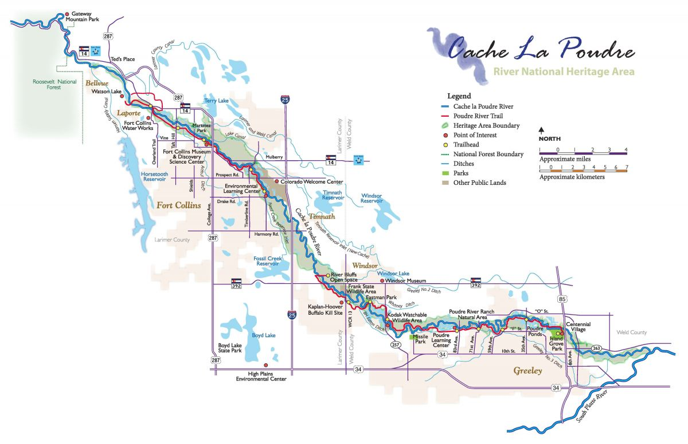

```{r}
#| echo: false

```

# Introduction

In this lab you will download streamflow data from the Cache la Poudre River (USGS site 06752260) and analyze it using the time series methods introduced in lecture. You will then use `modeltime` to predict future streamflow using both the time structure of the series and exogenous climate predictors.

This mirrors the Lees Ferry forecasting example from lecture — same `dataRetrieval` pipeline, same `modeltime` workflow, but now applied to a river you can see from campus. Like Lees Ferry, the Poudre is an operational water-supply system: Fort Collins, Loveland, and Greeley all depend on it, and the flows you forecast here directly inform how water managers plan deliveries.

```{r}
#| message: false
library(tidyverse)
library(plotly)

library(dataRetrieval)
library(climateR)
library(terra)
library(exactextractr)

library(tidymodels)
library(tsibble)
library(feasts)
library(modeltime)
library(timetk)
library(tseries)   # for stationarity tests
library(earth) #to use earth engine when building models 
library(prophet)
```

## Getting the Data

### Streamflow

Download daily streamflow for the Poudre at Mouth (USGS 06752260) and aggregate to monthly means. This is the same `readNWISdv()` + `renameNWISColumns()` pipeline from Lab 1 — the only addition is `yearmonth()` from `tsibble` to create a monthly time index.

```{r}
#| message: false
#| warning: false
poudre_flow <- readNWISdv(
  siteNumber = "06752260",
  parameterCd = "00060",
  startDate   = "2013-01-01",
  endDate     = "2023-12-31"
) |>
  renameNWISColumns() |>
  mutate(Date = yearmonth(Date)) |>
  group_by(Date) |>
  summarise(Flow = mean(Flow))

#poudre_flow <- read_waterdata_daily(
#  monitoring_location_id = "06752260",
  #parameter_code = "00060",
 # time = c("2013-01-01", "2023-12-31")) |>
 # renameNWISColumns() |>
 # mutate(Date = yearmonth(Date)) |>
 # group_by(Date) |>
 # summarise(Flow = mean(Flow))
```

### Historic Climate (GridMET)

We will use `climateR::getTerraClim()` to download monthly climate data for the Poudre basin (max temperature, precipitation, solar radiation). The `exactextractr` package spatially averages each raster layer over the basin polygon.

```{r}
#| message: false
#| warning: false
basin <- findNLDI(nwis = "06752260", find = "basin")

sdate <- as.Date("2013-01-01")
edate <- as.Date("2023-12-31")

gm <- getTerraClim(
  AOI       = basin$basin,
  var       = c("tmax", "ppt", "srad"),
  startDate = sdate,
  endDate   = edate
) |>
  unlist() |>
  rast() |>
  exact_extract(basin$basin, "mean", progress = FALSE)

historic <- mutate(gm, id = "gridmet") |>
  pivot_longer(cols = -id) |>
  mutate(name = sub("^mean\\.", "", name)) |>
  tidyr::extract(name, into = c("var", "index"), "(.*)_([^_]+$)") |>
  mutate(index = as.integer(index)) |>
  mutate(Date = yearmonth(seq.Date(sdate, edate, by = "month")[as.numeric(index)])) |>
  pivot_wider(id_cols = Date, names_from = var, values_from = value) |>
  right_join(poudre_flow, by = "Date")

# Validate: should have 132 rows (11 years × 12 months). If fewer, climate data
# is missing for some months and those flow months were silently dropped.
stopifnot("Climate join dropped flow months — check GridMET download" = nrow(historic) == 132)
```

### Future Climate (MACA)

Any time exogenous predictors are used for forecasting, **future values of those predictors must also be available**. We use MACA — a statistically downscaled climate dataset developed by the same group as GridMET — to get projected temperature, precipitation, and solar radiation through 2033.

Two differences from GridMET: temperature is in Kelvin (subtract 273.15 for °C) and variable names differ slightly.

```{r}
#| message: false
#| warning: false
sdate <- as.Date("2024-01-01")
edate <- as.Date("2033-12-31")

maca <- getMACA(
  AOI      = basin$basin,
  var      = c("tasmax", "pr", "rsds"),
  timeRes  = "month",
  startDate = sdate,
  endDate   = edate
) |>
  unlist() |>
  rast() |>
  exact_extract(basin$basin, "mean", progress = FALSE)

future <- mutate(maca, id = "maca") |>
  pivot_longer(cols = -id) |>
  mutate(name = sub("^mean\\.", "", name)) |>
  tidyr::extract(name, into = c("var", "index"), "(.*)_([^_]+$)") |>
  mutate(index = as.integer(index)) |>
  mutate(Date = yearmonth(seq.Date(sdate, edate, by = "month")[as.numeric(index)])) |>
  pivot_wider(id_cols = Date, names_from = var, values_from = value)

# Rename the 3 climate columns to match GridMET names (Date column stays first)
stopifnot("Unexpected MACA column count" = ncol(future) == 4)
names(future)[2:4] <- c("ppt", "srad", "tmax")  # order matches getMACA var request
future <- mutate(future, tmax = tmax - 273.15)   # Kelvin → °C
```

---

# Your Turn

## 1. Convert to tsibble

Convert `historic` to a `tsibble` object using `as_tsibble()`. A `tsibble` is a tidy time series data frame — it retains the date index and integrates with `feasts` functions for decomposition and visualization. Think of it as a tibble that knows it is ordered in time.

```{r}
#| eval: false
#| echo: false
pf <- as_tsibble(historic)
```

## 2. Plot the Time Series

Use `ggplot` to plot monthly Flow over time. Use `plot_ly()` from `plotly` for an interactive version — this lets you zoom into specific years or hover over values.

```{r}
#| eval: false
#| echo: false
g1 <- ggplot(pf, aes(x = as.Date(Date), y = Flow)) +
  geom_line(color = "steelblue") +
  labs(title  = "Monthly Streamflow — Cache la Poudre at Mouth",
       y = "Flow (cfs)", x = NULL) +
  theme_minimal()

plot_ly(pf, x = ~as.Date(Date), y = ~Flow, type = "scatter", mode = "lines",
        line = list(color = "steelblue")) |>
  layout(title = "Monthly Streamflow — Cache la Poudre at Mouth",
         xaxis = list(title = "Date"),
         yaxis = list(title = "Flow (cfs)"))
```

## 3. Seasonal Diagnostics

Before fitting any model, inspect the seasonal structure using two complementary `feasts` plots.

**Subseries plot** — one panel per month, each line is one year, the blue line is the monthly mean across all years:

```{r}
#| eval: false
#| echo: false
gg_subseries(pf, y = Flow) +
  labs(title = "Monthly Flow Patterns — Poudre at Mouth",
       y = "Flow (cfs)", x = "Year") +
  theme_minimal()
```

**Seasonal plot** — each line is one year plotted over the calendar cycle. Parallel lines = stable seasonal shape; diverging lines = changing pattern:

```{r}
#| eval: false
#| echo: false
gg_season(pf, y = Flow) +
  labs(title = "Seasonal Shape by Year",
       y = "Flow (cfs)", x = "Month") +
  theme_minimal()
```

Describe what you see. How are "seasons" defined in these plots? Is the seasonal shape consistent across years, or does it change? What physical process drives the May–June peak?

> answer: Seasons can be seen in these plots by the input of water by snowmelt. Typically, august through march show a relatively low flow, which can be defined as fall and winter. Spring an summer monthgs, from may to august, are shown by the increase in flow as the snowpack melts. Patterns can be seen in the seasonal shape across years, but variations in winter snowpack and rate of melt can cause changes in when flow peaks and how vastly it peaks. Snowmelt runoff drives the May-June peak flow because the snowpack typically fully melted at this times, causing inputs into the Cache la Poudre. 

## 4. Stationarity and Autocorrelation

Two diagnostics that directly inform ARIMA model selection:

**Lag plot** — plots Flow against its own lagged values. Strong linear patterns = high autocorrelation (ARIMA has something to work with). A diffuse cloud = no memory. Use `log1p(Flow)` — on the raw scale, peak months compress all other observations into the corner and hide the structure.

```{r}
#| eval: false
#| echo: false
pf |>
  mutate(log_flow = log1p(Flow)) |>
  gg_lag(y = log_flow, geom = "point") +
  labs(title = "Lag Structure of Monthly Poudre Flow (log scale)",
       x = "lag(log Flow, n)", y = "log Flow") +
  theme_minimal()
```

**Stationarity tests** — ARIMA requires a stationary series (constant mean and variance). Test formally before fitting:

```{r}
#| eval: false
#| echo: false
# Test on log_flow — that's what ARIMA will actually model
log_flow_vec <- log1p(pf$Flow)

# ADF: H0 = non-stationary; p < 0.05 rejects non-stationarity → series IS stationary
adf.test(log_flow_vec)
# series is stationary

# KPSS: H0 = stationary; p < 0.05 rejects stationarity → series is NOT stationary
kpss.test(log_flow_vec)
#series is not stationary 
```

What do the tests tell you? If the series is non-stationary, ARIMA will need `d ≥ 1` (differencing). Does the lag plot support the same conclusion?

> answer: The ADF test had a p-value lower than 0.01 (R couldn't print the smaller value), which means the null hypothesis is rejected and the series is stationary. However, the KPSS test has a p-value of 0.04, which also means the null hypothesis is rejects, but the series in non-stationary. The lag plot supports the KPSS test that the series in non-stationary because there isn't a linear relationship. 

## 5. Decomposition

Use `model(STL(...))` to decompose the time series into trend, seasonality, and remainder. Choose a trend window size you feel is appropriate and justify your choice. Extract components with `components()` and visualize with `autoplot()`.

```{r}
#| eval: false
#| echo: false
decomp <- pf |>
  model(STL(Flow ~ trend(window = 12) + season(window = "periodic"))) |>
  components()

autoplot(decomp)
```

Describe what you see:

- What does the **trend** tell you about long-term changes in Poudre flow? Is there evidence of a decline consistent with climate change or upstream demand?
> answer: The trend graph depicts that there is a decrease in flow since about 2016 and has been hovering aroung 200 cfs in recent years. This demonstrates a decline in flow that is consistent with climate change (reduced snowpack) and upstream demand (more water scarcity). 

- What drives the **seasonal** component? (Hint: snowmelt, irrigation withdrawals, reservoir releases)
> answer: The seasonal component is driven by water supply management and processes that occur on a yearly scale. Snowmelt in spring drives the peak flow in May/June. Withdrawals for irrigation during the summer months cause the decrease in flow as people are using more water than is being added, especially as snowmelt season ends. 

- Are there any spikes in the **remainder** that correspond to anomalous years you can identify?
> answer: In the remainder graph, we can see spikes responding to big rain storms and floods that could otherwise impact the overall flow in the Cache la Poudre. For example, there is a peak in the fall of 2013, which corresponds to the Front Range floods in September, 2013. There was also flooding in June of 2015, which can be seen in a spike on the graph. 

---

## Modeltime Prediction

### Data Preparation

Convert the historic tsibble and future tibble to plain tibbles with a `Date` column for `modeltime`. All predictor columns must be present in both the historic and future datasets — this is what enables the 10-year climate-driven forecast.

Streamflow is strictly non-negative but right-skewed — snowmelt peaks dwarf base-flow months. To prevent models from predicting negative flows, add a **log-transformed response** with `log1p(Flow)` (`log(Flow + 1)`, safe when flow is near zero). Fit all models on `log_flow`; back-transform predictions with `expm1()` (= `exp(x) - 1`) to return to cfs units.

```{r}
#| eval: false
#| echo: false
pf_tbl <- pf |>
  as_tibble() |>
  mutate(date     = as.Date(Date),
         log_flow = log1p(Flow),
         Date     = NULL)

future_tbl <- future |>
  as_tibble() |>
  mutate(date = as.Date(Date), Date = NULL) %>% 
  na.omit() #added NA omit because prophet models weren't predicting due to one NA value 

```

### Train / Test Split

Hold out the last 24 months (2022–2023) as the test set. This mirrors the `assess = "60 months"` logic from the CO₂ and Lees Ferry examples — the test set is always the most recent data, never a random sample.

```{r}
#| eval: false
#| echo: false
# Note: time_series_split() is deterministic — it always cuts at the same point
# regardless of the seed. set.seed() is kept here as a tidymodels convention
# (some resampling functions are random), but removing it gives identical results.
set.seed(10291991)
splits <- time_series_split(pf_tbl, assess = "24 months", cumulative = TRUE)

training <- training(splits)
testing  <- testing(splits)
```

### Model Definition

Choose at least three models — one ARIMA and one Prophet are required. Store model specifications in a list:

```{r}
#| eval: false
#| echo: false
mods <- list(
  # Classical seasonal ARIMA — relies on stationarity (check your tests above)
  arima_reg() |> set_engine("auto_arima"),

  # ARIMA + XGBoost residual boosting — picks up nonlinear climate relationships
  arima_boost() |> set_engine("auto_arima_xgboost"),

  # Prophet — handles trend breaks, missing data, and multiple seasonalities
  prophet_reg() |> set_engine("prophet"),

  # Prophet + XGBoost — as above, but boosts on residuals
  prophet_boost() |> set_engine("prophet_xgboost"),

  # Exponential smoothing — strong baseline for multiplicative seasonal data
  exp_smoothing() |> set_engine("ets"),

  # MARS — nonparametric spline model, useful for nonlinear climate response
  mars(mode = "regression") |> set_engine("earth")
)
```

### Model Fitting

Fit all models to the training data on the log scale. Exclude the raw `Flow` column so models only see `log_flow` as the response — each engine handles `date` and climate predictors internally.

```{r}
#| eval: false
#| echo: false
models <- map(mods, ~ fit(.x, log_flow ~ ., data = select(training, -Flow)))

(models_tbl <- as_modeltime_table(models))
```

### Calibration and Accuracy

Calibrate on the test set (2022–2023) to compute out-of-sample accuracy metrics. Pass `select(testing, -Flow)` so calibration uses the log-scale response:

```{r}
#| eval: false
#| echo: false
calibration_table <- modeltime_calibrate(models_tbl, select(testing, -Flow), quiet = FALSE)

modeltime_accuracy(calibration_table) |>
  arrange(mae) |>
  select(.model_desc, mae, mape, mase, rmse, rsq)
```

Describe what you see. Use these benchmarks to interpret the numbers:

- **MASE < 1** — the model beats a naïve seasonal forecast (last year's same month)
- **MAPE** — intuitive % error, but inflated in low-flow months when Flow ≈ 0
- **RMSE** — penalizes large errors heavily; compare to mean test-period flow for context
- Do boosted models (ARIMA-boost, Prophet-boost) outperform their base versions? If so, the nonlinear climate signal is worth capturing.

> answer: All six of the models beat a naïve seasonal forecase because they all have MASE values less than 1. The Earth model predicted the best across each of the benchmarks, with the lowest RMSE and MASE values, and highest R^2 values. Boosted models did *not* outperform their base versions. 

### Test Set Forecast

Forecast over the held-out test period and compare predictions to actuals. Back-transform with `expm1()` to return predictions to cfs. Two details matter: (1) `expm1(x)` is the exact inverse of `log1p(x)` and always returns values ≥ 0; (2) confidence interval lower bounds on the log scale can be slightly negative — floor them at 0 with `pmax(.conf_lo, 0)` *before* back-transforming so the ribbon never dips below zero cfs:

```{r}
#| eval: false
#| echo: false
test_forecast <- calibration_table |>
  modeltime_forecast(new_data = select(testing, -Flow), actual_data = pf_tbl) |>
  mutate(.value   = expm1(.value),
         .conf_lo = expm1(pmax(.conf_lo, 0)),
         .conf_hi = expm1(.conf_hi))

test_forecast |>
  filter(.key == "actual") |>
  ggplot(aes(x = .index, y = .value)) +
  geom_line(color = "grey40") +
  geom_line(data = filter(test_forecast, .key == "prediction"),
            aes(color = .model_desc)) +
  geom_ribbon(data = filter(test_forecast, .key == "prediction"),
              aes(ymin = .conf_lo, ymax = .conf_hi, fill = .model_desc),
              alpha = 0.1) +
  scale_color_brewer(palette = "Set1") +
  scale_fill_brewer(palette = "Set1") +
  labs(title  = "Test Set Forecast vs Actuals — Poudre at Mouth",
       x = NULL, y = "Flow (cfs)", color = "Model", fill = "Model") +
  theme_minimal() +
  theme(legend.position = "bottom")
```

Do predictions track actuals during the 2022–2023 test window? Are confidence intervals capturing observed values? Note any discontinuities at the 2022 boundary between training and test.

> answer: Predictions track actuals decently well during the 2022-23 test window. It seems as though the ARIMA regression model is consistently underpredicting flow during the test window. Overall, most model predictions tracked actuals well in 2023, struggling more to predict in 2022. There are slight dicontinuities at the 2022 boundary between training and test, with models jumping a little lower at the start of 2022 rather than smoothly transitioning from the training period. 

### Refit to Full Dataset

Refit all models to the complete 2013–2023 record before forecasting forward. Refitting allows auto-tuned models (`auto.arima`, `ets`) to re-optimize their parameters with more data:

```{r}
#| eval: false
#| echo: false
refit_tbl <- modeltime_refit(calibration_table, data = select(pf_tbl, -Flow))

modeltime_accuracy(refit_tbl) |>
  arrange(mae) |>
  select(.model_desc, mae, mape, mase, rmse, rsq)
```

Do the accuracy metrics change after refitting? Why or why not?

> answer: The accuracy metrics did not change after refitting. This might be due to the model not find any patterns and thus have not learned anything after the refit. 

### Forecast into the Future (2024–2033)

Use the refitted models with `future_tbl` as `new_data` to generate a 10-year climate-conditioned forecast. Back-transform with `expm1()`:

```{r}
#| eval: false
#| echo: false
future_forecast <- refit_tbl |>
  modeltime_forecast(new_data = future_tbl, actual_data = pf_tbl) |>
  mutate(.value   = expm1(.value),
         .conf_lo = expm1(pmax(.conf_lo, 0)),
         .conf_hi = expm1(.conf_hi))

future_forecast |>
  filter(.key == "actual") |>
  ggplot(aes(x = .index, y = .value)) +
  geom_line(color = "grey40") +
  geom_line(data = filter(future_forecast, .key == "prediction"),
            aes(color = .model_desc)) +
  geom_ribbon(data = filter(future_forecast, .key == "prediction"),
              aes(ymin = .conf_lo, ymax = .conf_hi, fill = .model_desc),
              alpha = 0.1) +
  scale_color_brewer(palette = "Set1") +
  scale_fill_brewer(palette = "Set1") +
  labs(title  = "10-Year Forecast — Poudre at Mouth (2024–2033)",
       x = NULL, y = "Flow (cfs)", color = "Model", fill = "Model") +
  theme_minimal() +
  theme(legend.position = "bottom")
```

---

## Wrap-up

Examine your 10-year forecast and reflect on the following:

1. **Model agreement**: Do ARIMA and Prophet project similar trajectories? If they diverge, what does that tell you about their different assumptions (statistical stationarity vs. flexible trend)?

> answer: ARIMA and Prophet models follow seasonal trends and they project similar trajectories. Notably, the prophet with regressors, ARIMA with XGBoost, and the regression with ARIMA predict similarly, with the prophet with XGboost diverging slightly. 

2. **Forecast quality**: Which model would you recommend to CWCB for water-supply planning? Justify with your accuracy metrics.

> answer: I would recommend CWCB use the Earth model. It looks like this model captures the most variance in flow, but with only two years of a testing window, it's hard to determine how accurate the variance the model predicts will be. Moreover, the Earth model had the best accuracy accross all metrics, according to the metrics table. 

3. **Negative predictions**: If any model predicts negative flow, explain why this happens and what you would do to fix it in a production context (hint: log-transformation of Flow before modeling).

> answer: No models predict negative flow. 

4. **Regressor value**: The MACA climate projections assume a specific emissions scenario. How does uncertainty in those projections propagate into your streamflow forecast?

> answer: Depending on the amount and composition of emissions created in the next 10 years, the MACA climate predicts could be under/over predicting their impacts. This uncertainty can propogate into streamflow forecasts because temperature and precipitation are correlated with streamflow. 

5. **Improvement path**: What information not in `tmax`, `ppt`, `srad` would most improve this forecast? (Consider: snowpack, upstream storage, irrigation demand.)

> answer: I think snowpack, irrigation demand, and reservior releases can all be added to the models to improve the forecast. These are important aspects of water supply and can help explain the variance year-to-year outside of the seasonal and long-term trends. If I had to choose only one, I think snowpack alone would most improve this forecast because it's what controls the timing and level of the late-spring peakflow. 

At this stage you have a working end-to-end time series forecasting pipeline — the same structural approach used by CWCB, USBR, and state water agencies for operational planning. The processes you learned in `tidymodels` apply directly here, and you can extend this framework with cross-validation (`time_series_cv()`), feature engineering (lag variables, rolling means), and hyperparameter tuning.

---

## Going Further (Optional): Add an Upstream Regressor

In lecture we showed that adding Glenwood Springs flow as an exogenous regressor improved Lees Ferry forecasts because upstream conditions carry physical information the model can't infer from time structure alone. Try the same approach here.

Download data from a headwater gage on the Poudre (e.g., North Fork Cache la Poudre, USGS 06746095) and add it as a predictor:

```{r}
#| eval: false
upstream <- readNWISdv(
  siteNumber  = "06746095",
  parameterCd = "00060",
  startDate   = "2013-01-01",
  endDate     = "2023-12-31"
) |>
  renameNWISColumns() |>
  # floor_date returns the 1st of each month as a Date — same type as pf_tbl$date
  mutate(date = floor_date(Date, "month")) |>
  group_by(date) |>
  summarise(upstream_flow = mean(Flow, na.rm = TRUE), .groups = "drop")

pf_reg <- pf_tbl |>
  left_join(upstream, by = "date") |>
  drop_na(upstream_flow)

splits_reg <- time_series_split(pf_reg, assess = "24 months", cumulative = TRUE)

# Use log_flow ~ . consistent with the main pipeline; exclude raw Flow
models_reg <- map(mods, ~ fit(.x, log_flow ~ .,
                               data = select(training(splits_reg), -Flow)))
```

Does adding upstream flow improve MASE on the test set? If yes, the physical signal is worth including. If not, the climate data alone may be sufficient for monthly aggregation at this timescale.
